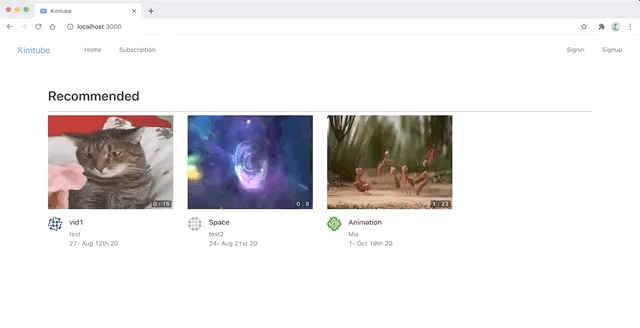
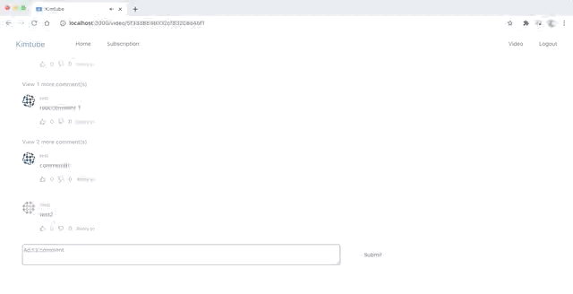

# kimtube
video posting web application using React (#YouTube clone)

## `LandingPage.js`

- Responsive design
- Navbar switching via login

## `VideoUploadPage.js`

### NPMs
- Dropzone: upload video from client
- ffmpeg: auto-generate video thumbnail
- Multer: save video to server

## `VideoDetailPage.js`

### Components
- `SideVideo.js`
- `LikeDislikes.js`
- `Comment.js` (`SingleComment.js` + `ReplyComment.js`)
- `Subscribe.js`

## `SubscriptionPage.js`

- Fetch subscription info via `userTo` & `userFrom`
- Compare video writer & local user's ids
